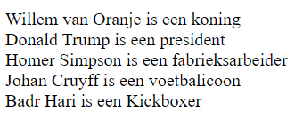

# PHP-EXPERT-Arrays-Taak02

## Medewerkers loopen 1

## Uitleg

In deze opdracht ga je door een array loopen met een for-loop. Zoals je hebt kunnen zien verandert het index _getal_ elke keer. Dus we kunnnen nu met een grotere array alle info tonen.

### Multidimensionale array

```php
$medewerkers = [
  [
    'voornaam' => 'Willem',
    'achternaam' => 'van Oranje',
    'functie'  => 'koning'
  ],
  [
    'voornaam' => 'Donald',
    'achternaam' => 'Trump',
    'functie'  => 'president'
  ],
  [
    'voornaam' => 'Homer',
    'achternaam' => 'Simpson',
    'functie'  => 'fabrieksarbeider'
  ],
  [
    'voornaam' => 'Johan',
    'achternaam' => 'Cruyff',
    'functie'  => 'voetbalicoon'
  ]
  ,
  [
    'voornaam' => 'Badr',
    'achternaam' => 'Hari',
    'functie'  => 'Kickboxer'
  ]
];

/*  De medewerkers-array heeft nu meerdere arrays. */

echo $medewerkers[0]['voornaam'];  //'Willem'
echo $medewerkers[$x]['voornaam']; // bij $x = 0 is de waarde 'Willem'
echo $medewerkers[$x]['voornaam']; // bij $x = 1 is de waarde 'Donald'
```

## Leerdoelen

> 1. [ ] Ik toon waardes op het scherm uit een associatieve array met een for-loop

## Opdracht

> 1. Neem de code uit het voorbeeld over in taak02.php
> 2. Schrijf een for-loop die door de array heen loopt.
> 3. Toon van elke persoon ALLE gegevens met een echo op het scherm.

## Eindresultaat



## Bronnen

> [W3 Schools - PHP Arrays](https://www.w3schools.com/php/php_arrays_associative.asp)  
> [W3 Schools - PHP For Loop](https://www.w3schools.com/php/php_looping_for.asp)  
> [Geek For Geeks - Associative Arrays in PHP](https://www.geeksforgeeks.org/associative-arrays-in-php/)  
> [PHP Manual - Arrays](https://www.php.net/manual/en/language.types.array.php)
